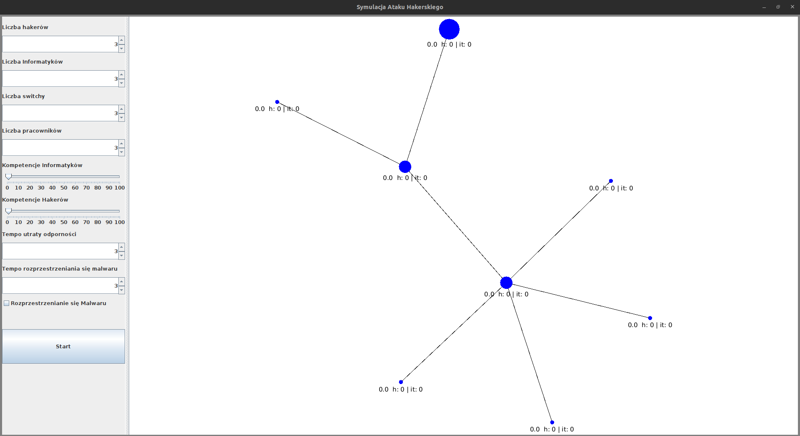

# Instrukcja używania GUI #

## Panel konfiguracji ##
Panel znajdujący się po lewej stronie. Umożliwia użytkownikowi ustawiać różne parametry symulacji.
1. Liczba hakerów - określa ilu hakerów zostanie utworzonych
2. Liczba informatyków - określa ilu informatyków zostanie utworzonych
3. Liczba switchy - określa ile switchy zostanie wygenerowanych w grafie
4. Liczba pracowników - określa ile komputerów zostanie wygenerowanych (Uwaga! Liczba komputerów musi być większa niż liczba switchy)
5. Kompetencje informatyków - określa medianę dla rozkładu normalnego, wg którego zostaną przypisane kompetencje informatyków 
6. Kompetencje hakerów - określa medianę dla rozkładu normalnego, wg którego zostaną przypisane kompetencje hakerów

#### (Elementy, które nie mają jeszcze odzwierciedlenia w symulacji) ####
7. Tempo utraty odporności - liczba punktów hakowania, które węzeł traci w trakcie tury, podczas gdy żaden agent nie wykonuje na nim akcji
8. Tempo rozprzestrzeniania się malwaru - liczba punktów hakowania, które węzeł przekazuje innym węzłom, z którymi jest połączony
9. Rozprzestrzenianie się malwaru - określa, czy węzeł przekazuje innym połączonym węzłom malware.

## Mapa symulacji ##

### Elementy grafu ###
Na mapie symulacji przedstawiony jest graf, który reprezentuje symulowaną sieć.
Wyróżniamy 3 rodzaje elementów:
1. Router - największy node, występuje tylko jeden
2. Switche - średniej wielkości nody, łączą sieć w całość
3. Komputery - są podłączone do switchy, reprezentują pracowników

### Stany elementów ###

Stan elementu to liczba pokazana na jego etykiecie, ujemne liczby oznaczają, że hakerzy mają inicjatywę, natomiast dodanie, że informatycy.

Stan elementu reprezentuje jego kolor:
- Czerwony oznacza, że inicjatywę na tym elemencie mają hakerzy
- Zielony oznacza, że inicjatywa należy do informatyków
- Niebieski oznacza, że element jest neutralny

### Obecność agentów w węźle ###

Gdy na danym węźle stacjonują informatycy, wtedy dodatkowo węzeł zyskuje zieloną obwódkę. W przypadku hakerów jest ona czerwona. Gdy na węźle jednocześnie operują zarówno haker jak i informatyk, wtedy połowa jest czerwona, a druga połowa zielona.