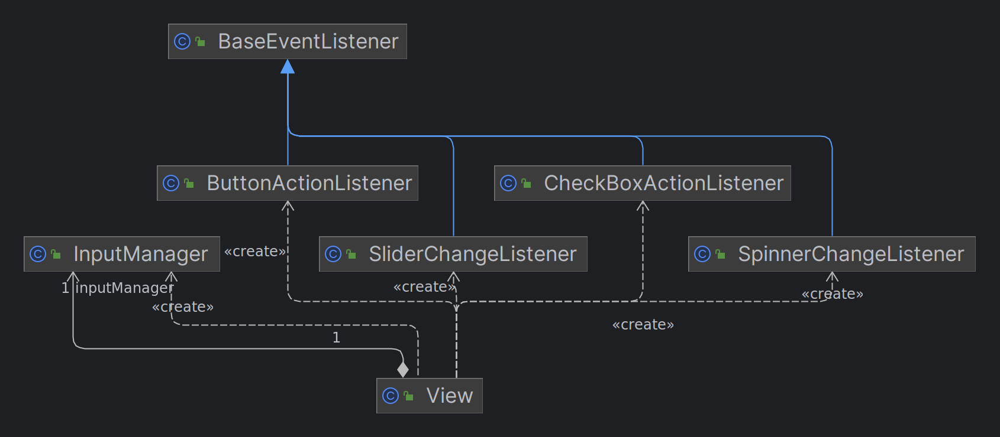
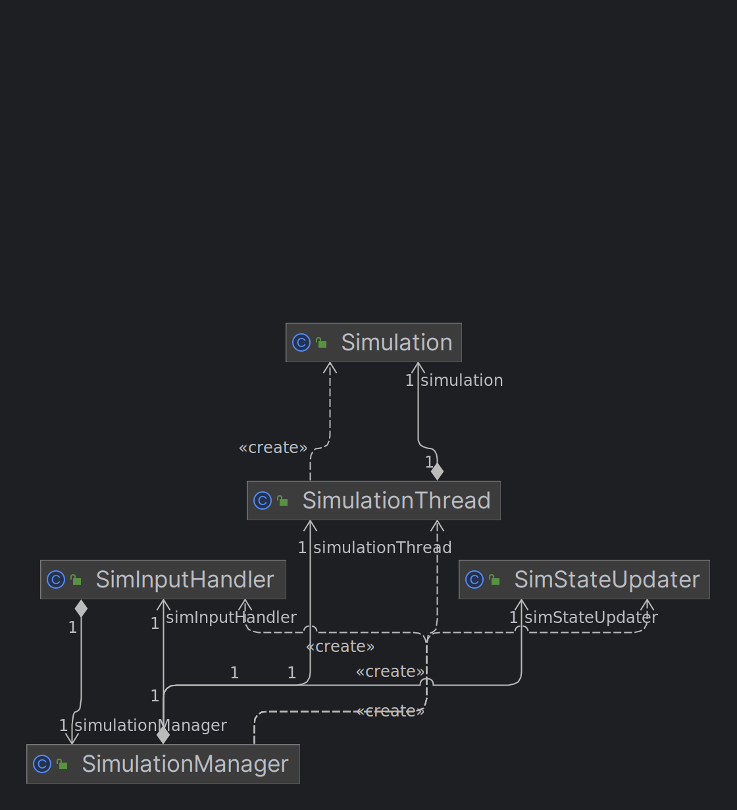

# Architektura #

## 1. Architektura aplikacji ##
### 1.1. Frontend (paczka app) ###
Obejmuje interfejs użytkownika oraz całą logikę związaną z wyświetlaniem a także przyjmowaniem danych od użytkownika.

#### View ####
Klasa odpowiedzialna za zarządzanie interfejsem użytkownika. Znajduje się tam logika odpowiedzialna za obsługę interfejsu, a także wyświetlanie grafu, będącego mapą, na której odbywa się symulacja.
#### Input manager ####
Zawarty poprzez kompozycje w instancji View. Jest odpowiedzialny za przetwarzanie inputu użytkownika i wysyłanie go do backendu.

#### Obsługa eventów ####
Jest realizowana poprzez Event Listenery, które dziedziczą po BaseEventListenerze. Każdy z nich implementuje jakiś rodzaj Event Listenerów z biblioteki Swing odpowiedzialnej za interfejs użytkownika.
Za jej pomocą odbierany jest input użytkownika.

### 1.2. Backend (paczka simulation) ###
Obejmuje logikę związaną z obsługą symulacji oraz odpowiedzialną za obsługę osobnego wątku symulacji.

#### Simulation Manager ####
Odpowiedzialnością tej klasy jest zarządzanie całym procesem symulacji. Zawiera ona SimInputHandler oraz SimStateUpdater odpowiedzialne za komunikację z interfejsem, a także SimulationThread, która jest odpowiedzialna za zarządzanie wątkiem, na którym działa symulacja.
#### SimStateUpdater ####
Jest odpowiedzialna za wysyłanie danych dotyczących obecnego stanu symulacji do GUI. Serializuje dane do postaci DTO i umieszcza je w kolejce podanej poprzez dependency injection.

#### SimInputHandler ####
Odpowiedzialny za interpretację inputu użytkownika podanego w postaci DTO. Wywołuje metody SImulationManagera i przez to umożliwia kontrolowanie go z poziomu GUI.
#### Simulation Thread ####
Odpowiedzialny za runtime symulacji. Dziedziczy po wbudowanej klasie Thread, co umożliwia uruchomienie go z poziomu SimulationManagera jako osobny wątek i kontrolowanie go poprzez kolejkę wstrzykniętą do niego poprzez dependency injection. 

## 2. Architektura Symulacji ##